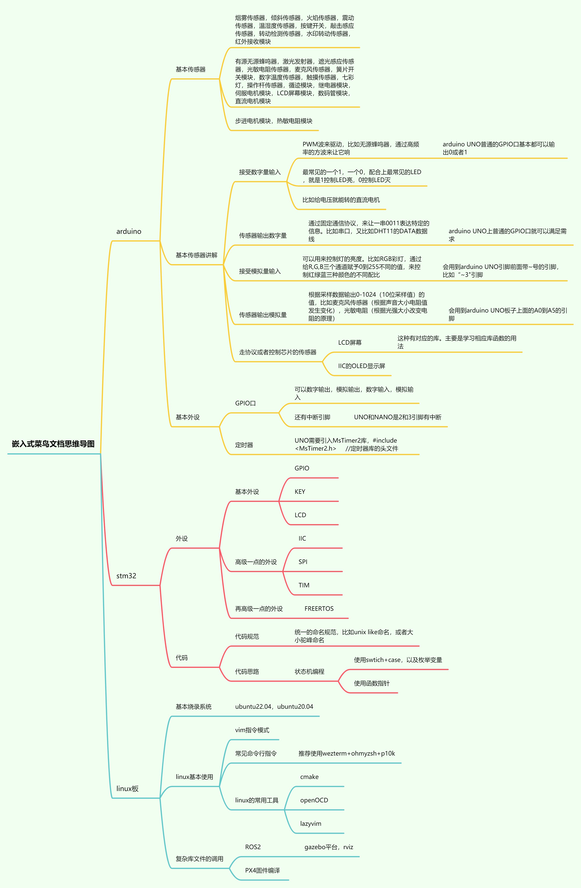

<!--
 * @Author: xuyang
 * @Date: 2024-05-04 15:14:29
 * @LastEditors: xuyang
 * @LastEditTime: 2024-05-04 16:29:33
 * @FilePath: \noob_needing_teach\基本思路.md
 * @Description: 
 * 
 * Copyright (c) 2024 by xuyang, All Rights Reserved 
-->
#  这是一份写给菜鸟看的嵌入式文档
整体大纲：

## Arduino

### 基本传感器

- **烟雾传感器**
- **倾斜传感器**
- **火焰传感器**
- **震动传感器**
- **温湿度传感器**
- **按键开关**
- **敲击感应传感器**
- **转动检测传感器**
- **水印转动传感器**
- **红外接收模块**
- **有源无源蜂鸣器**
- **激光发射器**
- **遮光感应传感器**
- **光敏电阻传感器**
- **麦克风传感器**
- **簧片开关模块**
- **数字温度传感器**
- **触摸传感器**
- **七彩灯**
- **操作杆传感器**
- **循迹模块**
- **继电器模块**
- **伺服电机模块**
- **LCD屏幕模块**
- **数码管模块**
- **直流电机模块**
- **步进电机模块**
- **热敏电阻模块**

### 基本传感器讲解

- **接受数字量输入**
  - PWM波来驱动
  - Arduino UNO普通的GPIO口基本都可以输出0或者1

- **传感器输出数字量**
  - 通过固定通信协议
  - Arduino UNO上普通的GPIO口就可以满足需求

- **接受模拟量输入**
  - 可以用来控制灯的亮度
  - 会用到Arduino UNO引脚前面带~号的引脚

- **传感器输出模拟量**
  - 根据采样数据输出0-1024的值
  - 会用到Arduino UNO板子上的A0到A5的引脚

- **走协议或者控制芯片的传感器**

### 基本外设

- **GPIO口**
  - 可以数字输出、模拟输出、数字输入、模拟输入
  - 还有中断引脚

- **定时器**
  - UNO需要引入MsTimer2库

## STM32

### 外设

- **基本外设**
  - GPIO
  - KEY
  - LCD

- **高级外设**
  - IIC
  - SPI
  - TIM

- **更高级的外设**
  - FreeRTOS

## 代码

### 代码规范

- **统一的命名规范**
- **代码思路**
  - 状态机编程
  - 使用switch+case，以及枚举变量
  - 使用函数指针

## Linux板

### 基本烧录系统

- **Ubuntu 22.04、Ubuntu 20.04**

### Linux基本使用

- **Vim指令模式**
- **常见命令行指令**
- **推荐使用Wezterm+OhMyZsh+P10k**

### Linux的常用工具

- **CMake**
- **OpenOCD**
- **Lazyvim**
- **复杂库文件的调用**

## ROS2

- **Gazebo平台**
- **RViz**

## PX4固件编译

